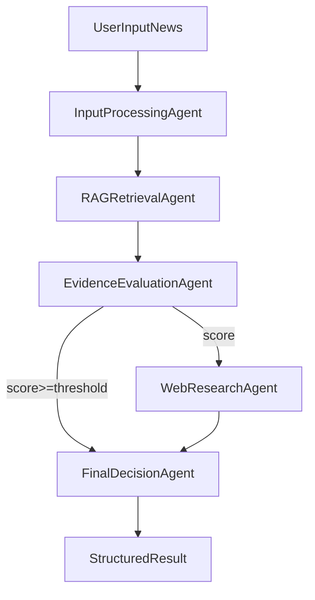

# ClearView Backend - Fake News Detection (CrewAI + RAG + Tavily)

A multi-agent fake news detection pipeline built with CrewAI.

The system:
- uses **Groq** models for reasoning,
- retrieves internal evidence from a **MongoDB Atlas vector index** (RAG),
- falls back to **Tavily web search** when RAG evidence is insufficient,
- returns a structured verdict: `Real`, `Fake`, or `Uncertain`.

## Features

- 5-agent CrewAI architecture:
  - Input Processing
  - RAG Retrieval
  - Evidence Evaluation
  - Web Research (Tavily fallback)
  - Final Decision
- Conditional fallback logic:
  - if `similarity_score >= RAG_SIMILARITY_THRESHOLD` -> skip web search
  - else -> run Tavily web search
- Structured JSON output for downstream use
- `MOCK_PIPELINE` mode for local smoke testing without external API keys

## Project Structure

```text
clearViewBackend/
├── main.py
├── crew.py
├── config.py
├── env.py
├── models.py
├── agents/
│   ├── input_agent.py
│   ├── rag_agent.py
│   ├── evaluation_agent.py
│   ├── web_search_agent.py
│   └── decision_agent.py
├── tasks/
│   ├── extract_information.py
│   ├── retrieve_evidence.py
│   ├── verify_facts.py
│   ├── analyze_sentiment.py   # currently hosts web-search task factory
│   └── produce_final_result.py
├── tools/
│   ├── rag_tool.py
│   ├── web_search.py
│   └── web_scraping_tool.py
├── rag/
│   ├── vectorDb.py
│   └── documents/
└── .env.example
```

## Architecture



## Requirements

- Python (project currently configured with `3.14` in `Pipfile`)
- MongoDB Atlas vector search index (for RAG path)
- API keys:
  - Groq (`GROQ_API_KEY`)
  - Tavily (`TAVILY_API_KEY`)

## Installation

### Option A: `venv` + `pip`

```bash
python -m venv .venv
source .venv/bin/activate
pip install -r requirements.txt
```

### Option B: Pipenv

```bash
pipenv install
pipenv shell
```

## Environment Setup

Create `.env` from `.env.example`:

```bash
cp .env.example .env
```

Then set values:

```env
GROQ_API_KEY=your_groq_key
TAVILY_API_KEY=your_tavily_key

MONGODB_COLLECTION=your_collection
ATLAS_VECTOR_SEARCH_INDEX_NAME=your_index_name
MONGODB_CONNECTION_STRING=your_connection_string
DB_NAME=your_database

RAG_SIMILARITY_THRESHOLD=0.75
GROQ_MODEL=llama3-8b-8192
GROQ_TEMPERATURE=0.2
GROQ_MAX_TOKENS=1024
MOCK_PIPELINE=false
```

## Running the App

### CLI mode

```bash
python main.py --news "Scientists claim drinking coffee cures COVID-19 overnight."
```

If `--news` is omitted, the app prompts interactively.

## Output Format

The pipeline returns a structured JSON object:

```json
{
  "classification": "Fake",
  "confidence": 0.89,
  "reasoning": "Concise evidence-based explanation.",
  "rag_evidence": [],
  "web_sources": []
}
```

## Tavily Integration Details

Tavily integration is implemented in `tools/web_search.py`:

- Uses official `tavily-python` client (`TavilyClient`)
- Search params:
  - `search_depth="advanced"`
  - `max_results=5`
- Normalized result schema:
  - `title`
  - `content`
  - `url`
- Graceful failure behavior:
  - missing key, dependency, or API/network errors return empty results (`[]`)
  - warnings/errors are logged for debugging

## Conditional Web Fallback Logic

The decision point is in `crew.py`:

- parse evaluation output (`rag_sufficient`, `similarity_score`)
- if insufficient evidence, run web search task and merge `web_sources`
- if sufficient evidence, skip web search and proceed directly to final decision

## Mock Mode (No External APIs)

Use mock mode for quick local verification:

```bash
MOCK_PIPELINE=true python main.py --news "WHO states vaccines reduce severe disease."
```

This runs deterministic mock behavior and still returns the standard output schema.

## Troubleshooting

- `GROQ_API_KEY is required unless MOCK_PIPELINE=true`
  - Set `GROQ_API_KEY` in `.env`, or set `MOCK_PIPELINE=true` for local tests.
- Tavily returns empty results
  - Verify `TAVILY_API_KEY` and internet access.
- CrewAI import/install issues on your Python runtime
  - Use the same interpreter used during dependency install.
  - If needed, create a fresh virtual environment and reinstall requirements.

## Quick Smoke Tests

```bash
MOCK_PIPELINE=true python main.py --news "WHO states vaccines reduce severe disease in peer reviewed study"
MOCK_PIPELINE=true python main.py --news "Scientists claim drinking coffee cures COVID-19 overnight"
```

Expected behavior:
- first input: likely no web fallback in mock mode
- second input: web fallback path is triggered in mock mode

